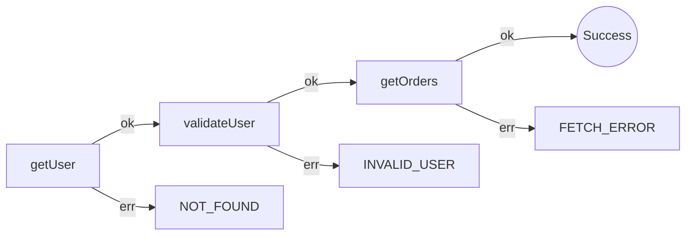

# Effect Analysis: fetchUserAndOrders

## Metadata

- **File**: `/Users/jreehal/dev/js/executable-stories-demo-effect/src/effect.test.ts`
- **Analyzed**: 2026-09-13T20:36:17.605Z
- **Source Type**: generator
- **TypeScript Version**: 6.0.2


## Effect Flow




## Statistics

- **Total Effects**: 3


## Explanation

```
fetchUserAndOrders (generator):
  1. Yields user <- getUser
  2. Yields validatedUser <- validateUser
  3. Yields orders <- getOrders

  Error paths: FetchError, InvalidUser, NotFound
  Concurrency: sequential (no parallelism)
```


## Error Types

- `FetchError`
- `InvalidUser`
- `NotFound`

